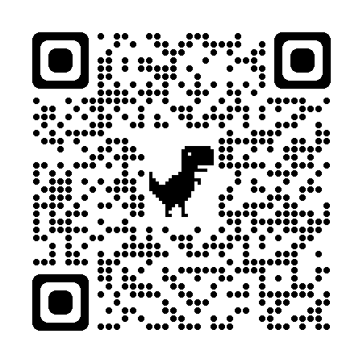

# 1 - Headings

How to give headings in markdowns

# Heading 1

## Heading 2

### Heading 3

#### Heading 4

##### Heading 5

##### Heading 6

# 2 - Block of Words

This is a normal text in markdown

> This is a block of special text

> This is a second line

# 3 - Line Breaks

Tfihwefiwgjnnfn Himanshur dlkwqe.\
eojr2urj peo ernejfnjNFJN e hefihefhi egulirhlru rthurgihr.

erfhwrfirgg.\
ethuguhgu4h3t4 gorjghuge.

# 4 - combine two things

Block of words and headings

> ## Heading 2

# 5 - face of text

**Bold**

*Italic*

***Bold and Italic***

Or you can use this symbols -

_(underscore)

**BOLD**

*Italic*

# 6 - Bullet Points/Lists

- Day 1
- Day 2
- Day 3
- Day 4
- Day 5
  - Day 5a
    - sub list(Anything)
  - Day 5b
- Day 6
- Day 7

> *using * or +**

- one

- one

> Numbering of lists

1. Day 1
2. Day 2
3. Day 3
4. Day 4
5. Day 5
   1. Day 5a
   2. Day 5b
6. Day 6
7. Day 7
8. Day 8

# 7 - line breaks or page breaks

This is Page 1
---

___
***
This is page 2.

# 8 - Link and Hyperlinks

<https://www.youtube.com/>

[link](https://www.youtube.com/)

[Youtube](https://www.youtube.com/)

[Youtube channel]: https://www.youtube.com/

This whole course is [here][Youtube Channel]

# 9 - Images and figures with links

To join the youtube Scan the QR code:



online picture:

![Markdown](data:image/png;base64,iVBORw0KGgoAAAANSUhEUgAAAR4AAACwCAMAAADudvHOAAAAb1BMVEX///8AAABTU1NjY2N7e3vU1NRcXFwoKCj19fVtbW36+vo2NjbS0tJYWFiOjo7m5ua7u7sZGRnIyMibm5uVlZUPDw/BwcF1dXWqqqoyMjIdHR3h4eFgYGA0NDTFxcWKioo9PT1LS0uysrKAgIBDQ0N2SOJTAAAGLUlEQVR4nO2dbWOaPBiFg3ZOpF0r6mzXl3Xr8/9/4yOtGhKSQ+7wujv39W2di+FaOXIAg1IGm3KfF9ssSbZFvi83yk+5nHqK07MsPXLeXqee2jx4enPIWa+mntZ8WK1tO7dTT2le3Jp2Hqaez9x4EDuQB9mzINf9az31TObJJZ/lM8vJ6ny8M/U85srX8c/T1NOYK6+fTWLqWcyXql80e1axSJKiIWJ56uj2z3aNI+pUWO9sF5vGvnU/9SSn5L6xd+3FTg3Lz17l5p419fymxty/cmUGUrK5c8FsEIXamn9MHuPX5aAMW4upJzc9C0OI6LEQPRDRAxE9ENEDET0Q0QMRPRDRAxE9ENEDET0Q0QMRPRDRAxE9ENEDET0Q0QMRPZBYPb9fll7QzdJ+/q68A949E8fa+WeXkwaK1XOX+bkjbswn38CA2TfiYEf/UL9IA8XqgfeQ/SBujWq7ZY+q58Y/1HfSQIPoyX4SN0ep95T0kO9dAHsDRz1b2uY84tHY6aHFM4xllnoo8dx+JzU/PYR4bt7Gl4Ce4HhuiWWueg5hM2iLZa56wjpbayyz1RMSz2FfcOGpJyCe8dEycz2t8RwQy5z1tBw9h8QyZz04noNimbUeFM/h3zvkqwfEc1gsM9fjjefAWOaux3P6MjSWuetxjxMcyxWs9bjimfZ1cN56HPEcHssVzPU04pkQyxXc9VjxTInlCu56zHPPpFiuYK+nHs/0VTr466nFMy2WKxLQc41nYixXpKDnfHKDGssVKej5imdyLFckoaeK57jFk9LQc4rn9kt+LhLRk+XtL3GRip5IRA9E9EBED0T0QDjp+RP34Y26Bic9q6hDv+Mz+EtOehbqZ4AOiwK2DV561I8AISbrlPTA7xR4tj8lPepXgBPNo0pMj73mH+SoUtNDieevJdz61PPhH2omegjxvI7T83Hj4wOczT74/1neXIhwOD3B8XzedrIe0v4bwkPzPQbUo8IeH/OoIvUodCAZwaPjLYbUE/Tfe7y8OiJ7el30f+96hyH1hMTz+/XFMdHc4yMjbpxvMKiegHjWaRj1yRVzVcjJi3v8YfW0xnNtu+M+2On1xckfz/AD62mJ53oaRh73RFxzbfLkG31oPTCej/VXxh4W9nBi7uBdeXloPSie340XRh81/xcgAONfl3pwPSAdzFnFl4quj9YAaywMr8cbz9Y2x+tZH8I0eLgFQ4+gx3Nywz5I7VBJO9UL+KWqMfQ4Z3+0X9WlsXeoF64qMa4e12OJmuvQdzqhEV0vnFViZD2OeG5+WHQ73xNZL9xVYmw9jXh2bG/H02FR9cJTJUbXY8Wza4fverYwol74qsT4eox4bsRyH3ro9cJbJcbXUz96dj8epPu5ZmK98FcJzWh6ar/87mn1cCqeVi9CHnEznp5rPHu2tY8rFZR6EbRc24h6zvHsOw7rQw+hXqAqoRlTz2c8O2O5opfrXMH1InD5nDH1VPHsf2pTP5cBA+sFrhKaUfWc4tmfhz1dJQ2qFy1VQjOuHgXysK+LyAH1oq1KaEbWA+jtGntrvWitEhqGetrqRXuV0HDUg+tFQJXQsNSDZrclrQfMUw+oF7TlSpnq8dYL4srPXPV46kVYldBw1eOuF+SFktnqcdWL0Cqh4aunWS+Cq4SGsR67XoRXCQ1nPWa9IFQJDWs99XpBqRIa3np0vSBVCQ1zPZd5biMfLc9dz7leUJ98cIG9HvU9I1cJzQAPgYkLwcH0nOoFtUpo+n+E0MvvuJk83/X3CCGDe8d3JUKRB1BBRA9E9EBED0T0QEQPRPRARA9E9EBED0T0QEQPRPRARA9E9EBED0T0QEQPRPRARA9E9EAsPcaSF/4b/JPBWN/0YK1VHnnllQ/m8qaFMhcr3009vanZGTpytTf+HH1pmgnW/Yl7VWbi54p992apNtZPsl2y+bPe2S42Si3tn2XFIkmaa3IvT87svUu4Ula/U13XCmLL6+cu51gtRah4+4qkcZ8h8M+wuiT21BOZJ9dP8F5XIuVC7f67Hlci5YJx/534sbDuTpT9y6BxZ+taPr+urFy9qox70g07nt48naxs9q/kWJagtG7KfV50W3Hzn+VQ5PvS+s77//GMfLIzN0VeAAAAAElFTkSuQmCC)

# 10 - Adding code or code block

To print a string use `print("youtube")` :

```print('Himanshu')```

> this code with show color according to Python language Syntax

``` python
x = 5 + 6
y = 3 - 2
z = x+y
print(z)
```

> this code with show color according to JavaScript language Syntax

``` javascript
x = 5 + 6
y = 3 - 2
z = x+y
print(z)
```

# 11 - adding tables

| species    | petal_length | sepal_length |
| :--------- | -----------: | :----------: |
| virginica  |         18.2 |     19.2     |
| setosa     |         15.1 |     17.2     |
| versicolor |         12.2 |     12.4     |
| rose       |         7.89 |     8.90     |

# 12 - contents

[1 - Headings](#1---headings)

[2 - Block of Words](#2---block-of-words)

[3 - Line Breaks](#3---line-breaks)

[4 - Combine  Two Things](#4---combine-two-things)

[5 - Text face](#5---face-of-text)

[6 - Bullet](#6---bullet-pointslists)

[7 - Line/Page Breaks](#7---line-breaks-or-page-breaks)

[8 - Links](#8---link-and-hyperlinks)

[9 - Figure Links](#9---images-and-figures-with-links)

[10 - Code/Code Blocks](#10---adding-code-or-code-block)

[11 - Tables](#11---adding-tables)

[12 - Contents](#12---contents)

[13 - Extensions](#13---install-extensions)


# 13 - Install Extensions

**Sample Text**

**Bold**

_Italic_

**_Italic and Bold_**

[Link](https://www.youtube.com/)


~~Image~~


Column A | Column B | Column C
---------|----------|---------
 A1 | B1 | C1
 A2 | B2 | C2
 A3 | B3 | C3


Column A | Column B | Column C
---------|----------|---------
 A1 | B1 | C1
 A2 | B2 | C2
 A3 | B3 | C3


 